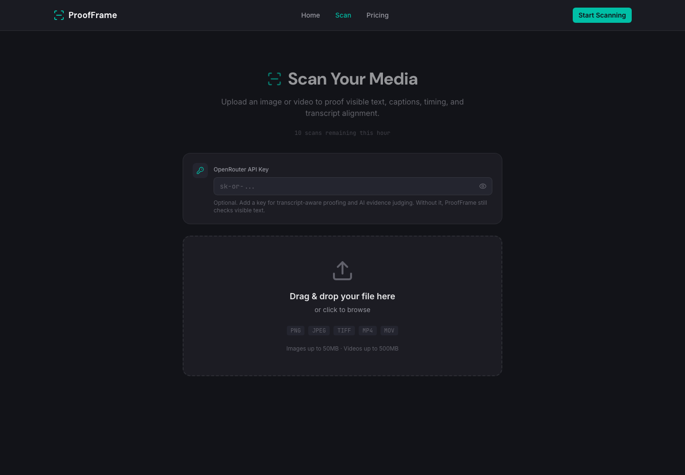

<div align="center">

# 🔍 ProofFrame

**OCR-powered spell checker for burned-in text in videos and images, with a server-side transcript-aware proofing pipeline and BYOK OpenRouter integration.**

[](https://reactjs.org)
[](https://www.typescriptlang.org)
[](https://vitejs.dev)
[](https://tailwindcss.com)

[Features](#-features) · [Architecture](#-architecture) · [Getting Started](#-getting-started) · [Deploy](#-deploy)



</div>

---

## ✨ Features

- **Image proofing (in-browser)** — Drop a PNG/JPG/TIFF/WebP, run OCR with Tesseract.js entirely in the browser, and flag misspelled burned-in text with bounding-box overlays.
- **Video proofing (local server pipeline)** — Upload MP4/MOV/WebM; a local Node service extracts timestamped frames with native ffmpeg, OCRs them, groups visible text into time-ranged segments, and spell-checks them.
- **Transcript-aware proofing (BYOK)** — With an OpenRouter API key, the server runs consensus audio transcription across multiple models and checks on-screen captions against speech for mismatches, missing captions, and timing issues.
- **AI evidence judge (BYOK)** — Optional OpenRouter pass that confirms/rejects candidate issues to cut false positives.
- **Graceful degradation** — No key, no audio track, or an out-of-credit key never fails the scan; it degrades to visible-text proofing and reports exactly what was checked.
- **PDF export** — Generate a report of findings with jsPDF.
- **Custom dictionary** — Add project-specific words (brand names, jargon) to suppress false positives; stored in `localStorage`.
- **Rate limiting** — Client-side hourly scan quota.
- **Polished, responsive UI** — Tailwind CSS 4, Framer Motion animations, dark theme.

## 🧱 Architecture

ProofFrame is a **two-process app**:

| Process | What it does | Where it can run |
|---------|--------------|------------------|
| **Web frontend** (Vite/React) | Landing/pricing pages, scan UI, and the entire **image** scan pipeline (OCR + spell-check) client-side | Any static host (Vercel, etc.) |
| **Analysis API** (Express) | The **video** proofing pipeline: native ffmpeg frame/audio extraction, server-side OCR, transcript consensus, alignment, and the AI judge | A long-running Node host with `ffmpeg`/`ffprobe` installed and writable disk |

The frontend talks to the API at `/api/*`. In development the Vite dev server proxies `/api` to the backend. In a deployed split setup, set `VITE_PROOFFRAME_API_BASE` so the static frontend points at the hosted API.

**BYOK:** there is no server-stored AI key. Each user pastes their own OpenRouter key into the scan settings (stored in `localStorage`); it is forwarded to the backend only for the duration of that scan and is never persisted server-side.

Video jobs and their artifacts (frames, crops, audio, `result.json`) are written under `.proofframe/jobs/<scanId>/` (gitignored).

## 🚀 Getting Started

### Prerequisites
- Node.js 18+ (developed on Node 22)
- `ffmpeg` and `ffprobe` on `PATH` (required for **video** scanning; image scanning works without them)
  - macOS: `brew install ffmpeg`

### Install & run

```bash
git clone https://github.com/markksantos/proofframe.git
cd proofframe
npm install

# Optional: copy and tweak env config
cp .env.example .env

# Start both the API and the web app together
npm run dev
```

- Web app: http://localhost:5173
- Analysis API: http://127.0.0.1:8787 (health: `/api/health`)

Open the app, go to **Scan**, and drop an image or video. For transcript-aware video proofing, paste an OpenRouter key in the settings card (optional).

### Scripts

| Script | Description |
|--------|-------------|
| `npm run dev` | Run API + web concurrently (development) |
| `npm run dev:web` | Web only (Vite) |
| `npm run dev:api` | API only (tsx watch) |
| `npm run start:api` | API only, production (tsx, no watch) |
| `npm run build` | Type-check + production web build to `dist/` |
| `npm run typecheck` | Type-check without emitting |
| `npm run lint` | ESLint |
| `npm test` | Vitest |

## 🌐 Deploy

ProofFrame deploys as two pieces:

1. **Frontend → Vercel** (static). `vercel.json` sets the SPA rewrite and the COOP/COEP headers that Tesseract.js/WASM need. Build command `npm run build`, output `dist/`. Set `VITE_PROOFFRAME_API_BASE` to your API origin at build time so video scans reach the backend.
2. **Analysis API → a long-running Node host** (Render, Railway, Fly, a VPS — anywhere you can install `ffmpeg` and keep a process alive with writable disk). Run `npm run start:api`. Lock down CORS with `PROOFFRAME_CORS_ORIGIN=<your frontend origin>`.

> The API **cannot** run on Vercel/Netlify serverless: it needs native ffmpeg, persistent disk for job artifacts, and long-lived polling jobs.

If you only need **image** proofing, the static frontend alone is fully functional — video scanning simply reports the API as unavailable.

### Environment variables

See [`.env.example`](.env.example). Summary:

| Variable | Process | Purpose |
|----------|---------|---------|
| `PROOFFRAME_API_PORT` | API | API port (default `8787`) |
| `PROOFFRAME_CORS_ORIGIN` | API | Comma-separated allowed origins (production) |
| `PROOFFRAME_JUDGE_MODEL` | API | Override the AI judge model |
| `PROOFFRAME_STT_MODELS` | API | Override the transcription models |
| `VITE_PROOFFRAME_API_BASE` | Web (build-time) | API origin for deployed split mode |

## 🛠️ Tech Stack

| Category | Technology |
|----------|-----------|
| Frontend | React 19, TypeScript 5.9, Vite 7 |
| Styling | Tailwind CSS 4 |
| Routing | React Router DOM 7 |
| Animations | Framer Motion 12 |
| OCR | Tesseract.js 7 (browser + server) |
| Backend | Express 5, Node.js, native ffmpeg/ffprobe |
| Spell Check | nspell 2 (en_US Hunspell dictionary) |
| AI (BYOK) | OpenRouter (audio transcription + evidence judge) |
| PDF | jsPDF 4 |
| Icons | Lucide React |
| Tests | Vitest |

## 🎯 How It Works

**Images** (browser): upload → Tesseract OCR → nspell spell-check → overlay errors → optional PDF export.

**Videos** (server): upload → native ffmpeg extracts audio + timestamped frames → (BYOK) consensus transcription across OpenRouter models → server OCR per frame → group visible text into time-ranged segments → spell-check + align against transcript (mismatch / missing-caption / timing / unreadable) → optional AI evidence judge → results with frame thumbnails, crops, and time ranges.

## 📄 License

MIT License © 2025 Mark Santos
